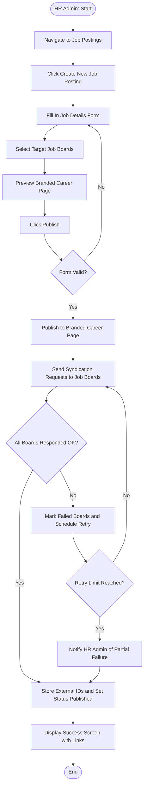
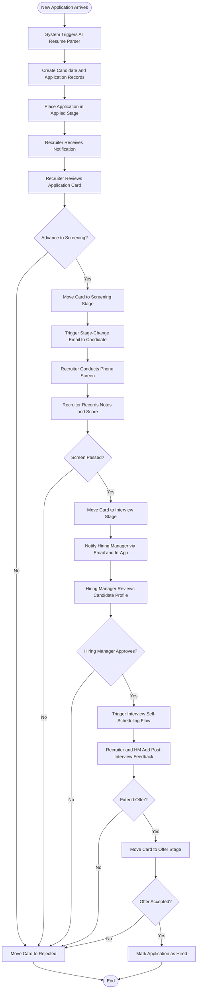
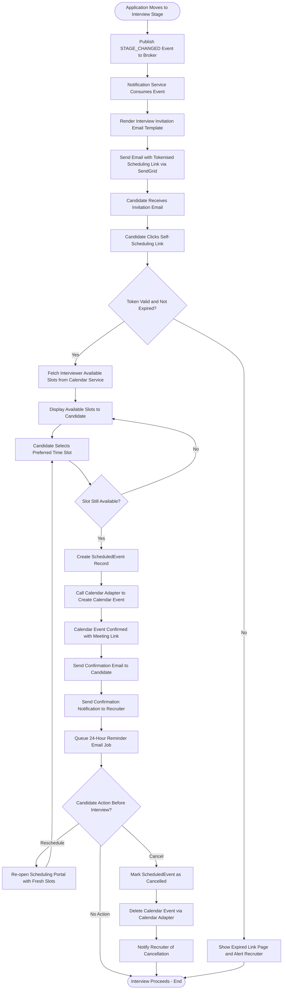
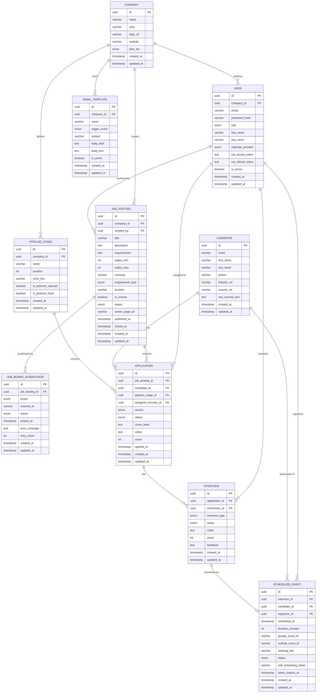
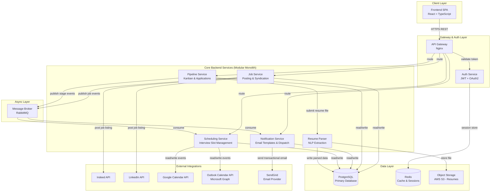
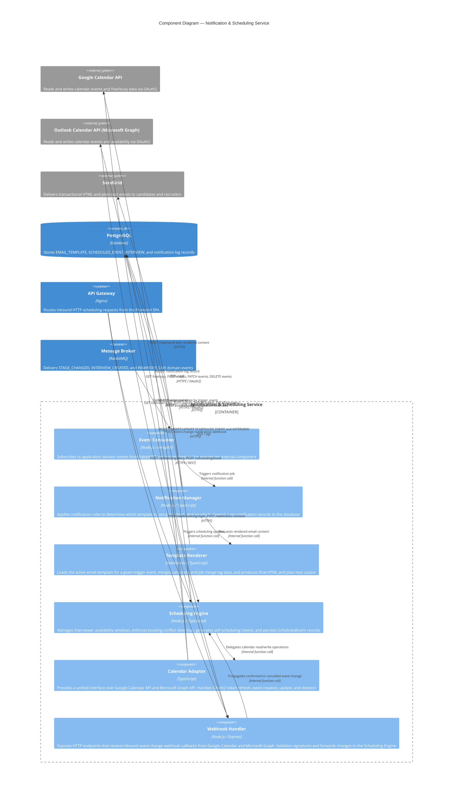

# LTI ATS — System Design Document

---

## 1. LTI Software Description

LTI is a next-generation Applicant Tracking System purpose-built for small and growing companies that are tired of managing hiring through spreadsheets, disconnected email threads, and a patchwork of separate job-board logins. LTI consolidates the entire recruitment lifecycle — from writing and distributing a job posting to confirming a final-round interview — into a single, lightweight platform that can be set up in minutes and mastered in hours. By eliminating the administrative overhead that consumes the working day of HR generalists and founders who simultaneously manage operations, finance, and people, LTI enables small teams to hire faster, with greater consistency, and with a candidate experience that reflects well on their employer brand from the very first touchpoint.

The ATS market has historically been dominated by enterprise platforms (Greenhouse, Lever, Workday) architected for large organisations that require weeks of onboarding, costly implementations, and dedicated system administrators. Workable and BambooHR have made inroads into the SMB segment, but still carry significant feature bloat and pricing models that scale uncomfortably for companies with fewer than fifty employees. LTI enters this gap as a lean, automation-first product whose core design principle is clear: every manual task a recruiter no longer has to perform is a direct competitive advantage. The timing is ideal — remote and hybrid work has expanded talent pools globally while simultaneously multiplying inbound application volumes, making the pain of manual hiring management more acute than ever for small teams operating without dedicated sourcers or coordinators.

LTI's competitive advantages over existing solutions are concrete and measurable. First, **one-click multi-board syndication** publishes a job to Indeed, LinkedIn, and a branded career page in a single action, eliminating separate logins and copy-paste workflows. Second, **AI-powered resume parsing** automatically extracts structured contact information, work history, and skills from uploaded CVs the moment an application arrives, removing manual data entry entirely. Third, a **real-time collaborative Kanban pipeline** gives recruiters and hiring managers a shared, drag-and-drop view of every candidate's status, replacing ad-hoc status requests with a live shared workspace. Fourth, **self-service interview scheduling with native calendar sync** (Google Calendar and Outlook) collapses what typically takes five to seven email exchanges into a zero-touch candidate-driven flow that books directly into the interviewer's calendar. Fifth, **triggered automated communications** notify candidates at every stage transition using customisable email templates, driving measurably higher offer-acceptance rates and protecting employer brand at scale without any additional recruiter effort.

---

## 2. Main Functions

### Pillar 1 — One-Click Job Posting & Syndication

| Feature                          | Description                                                                                                                                                                                                                                | Primary User Role |
| -------------------------------- | ------------------------------------------------------------------------------------------------------------------------------------------------------------------------------------------------------------------------------------------ | ----------------- |
| **Job Posting Composer**         | A rich-text editor with structured fields (title, description, requirements, salary range, employment type, location, remote flag) that produces a publication-ready job listing. Supports saving as draft before publishing.              | HR Admin          |
| **Multi-Board Syndication**      | Distributes a published job to selected external job boards (Indeed, LinkedIn) with a single click over their respective posting APIs. Stores syndication status and external IDs per board for tracking and withdrawal.                   | HR Admin          |
| **Branded Career Page**          | Automatically generates a publicly accessible, company-branded career page listing all active job postings. The page is hosted under a unique subdomain (`[slug].lti.careers`) and can embed on the company website via an iframe snippet. | HR Admin          |
| **Syndication Status Dashboard** | Displays real-time publish status (Pending, Published, Failed) for each job-board channel, along with error messages and retry controls when a board API returns a failure.                                                                | HR Admin          |
| **Job Lifecycle Management**     | Enables HR Admins to close, archive, or unpublish a job posting across all syndicated boards and the career page from a single action, ensuring no stale listings remain visible.                                                          | HR Admin          |

### Pillar 2 — Visual Candidate Pipeline & Centralized Management

| Feature                           | Description                                                                                                                                                                                                                                         | Primary User Role         |
| --------------------------------- | --------------------------------------------------------------------------------------------------------------------------------------------------------------------------------------------------------------------------------------------------- | ------------------------- |
| **Drag-and-Drop Kanban Board**    | A visual pipeline board with customisable stages (e.g., Applied, Screening, Interview, Offer, Hired, Rejected). Cards represent individual applications and can be moved between stages by dragging, automatically triggering status-change events. | Recruiter, Hiring Manager |
| **Application Inbox**             | A chronological feed of all new applications received across all active job postings, with resume attachment, source attribution (career page, Indeed, LinkedIn), and one-click routing to the Kanban board.                                        | Recruiter                 |
| **AI Resume Parsing**             | Automatically extracts structured data (full name, email, phone, LinkedIn URL, work history, education, skills) from uploaded PDF/DOCX resumes using an NLP parsing engine, populating the Candidate profile without manual entry.                  | Recruiter                 |
| **Candidate Profile**             | A unified view of a candidate's parsed resume data, application history across all postings, interview notes, scores, and communication log, accessible by both Recruiters and Hiring Managers without hunting across email threads.                | Recruiter, Hiring Manager |
| **Collaborative Notes & Scoring** | Allows any team member with access to attach timestamped notes and a numeric score to an application card. Notes are visible to all collaborators in real time, enabling asynchronous hiring-team alignment.                                        | Recruiter, Hiring Manager |
| **Candidate Database Search**     | A searchable index of all candidates ever processed, allowing Recruiters to re-engage past applicants for new openings using keyword search across parsed resume fields.                                                                            | Recruiter                 |

### Pillar 3 — Automated Communication & Interview Self-Scheduling

| Feature                            | Description                                                                                                                                                                                                                                                            | Primary User Role         |
| ---------------------------------- | ---------------------------------------------------------------------------------------------------------------------------------------------------------------------------------------------------------------------------------------------------------------------- | ------------------------- |
| **Email Template Library**         | A set of pre-built, fully editable email templates for recurring communication events (application received, stage change, interview invitation, reminder, offer, rejection). Templates support merge tags (candidate name, job title, company name, scheduling link). | HR Admin                  |
| **Triggered Status Notifications** | Automatically dispatches the appropriate email template to the candidate whenever their application card is moved to a new pipeline stage, eliminating manual follow-up emails and reducing candidate ghosting.                                                        | Recruiter                 |
| **Self-Scheduling Portal**         | Generates a tokenised, time-limited scheduling link included in interview invitation emails. Candidates click the link to view the interviewer's real-time available slots and book their own time, with no back-and-forth required.                                   | Candidate                 |
| **Native Calendar Sync**           | Connects Recruiter and Hiring Manager accounts to Google Calendar or Microsoft Outlook via OAuth2. The system reads availability, creates confirmed interview events, and writes accepted bookings back to the connected calendar automatically.                       | Recruiter, Hiring Manager |
| **Interview Lifecycle Management** | Tracks each interview through Scheduled, Confirmed, Completed, Cancelled, and No-Show states. Sends automated reminder emails to candidates 24 hours before the interview and notifies the interviewer of cancellations or reschedule requests immediately.            | Recruiter, Hiring Manager |
| **Reschedule & Cancellation Flow** | Provides candidates with a one-click reschedule or cancel option in both confirmation and reminder emails. Rescheduling re-opens the self-scheduling portal; cancellations update the calendar event and alert the Recruiter in real time.                             | Candidate, Recruiter      |

---

## 3. Lean Canvas

| **Lean Canvas Cell**         | **Content**                                                                                                                                                                                                                                                                                                                                                                                 |
| ---------------------------- | ------------------------------------------------------------------------------------------------------------------------------------------------------------------------------------------------------------------------------------------------------------------------------------------------------------------------------------------------------------------------------------------- |
| **Problem**                  | Small companies (< 50–100 employees) manage recruiting through spreadsheets and email, resulting in lost applications, missed follow-ups, hours wasted on scheduling logistics, and inconsistent candidate communication that damages employer brand. Existing ATS tools are either too expensive, too complex, or both for teams without a dedicated HR function.                          |
| **Customer Segments**        | Primary: HR generalists, office managers, and founders at companies with 5–100 employees who are actively hiring but lack dedicated recruiting resources. Secondary: Part-time or fractional recruiters supporting multiple small clients simultaneously.                                                                                                                                   |
| **Unique Value Proposition** | Hire faster with zero administrative drag. LTI is the only ATS built specifically for small teams — set up in under 30 minutes, post to multiple job boards in one click, and let candidates schedule their own interviews directly into your calendar.                                                                                                                                     |
| **Solution**                 | (1) One-click job posting syndicated to Indeed and LinkedIn simultaneously. (2) Drag-and-drop Kanban pipeline with AI resume parsing so every applicant is automatically structured. (3) Self-service interview scheduling with Google Calendar and Outlook sync, backed by automated candidate email notifications at every stage.                                                         |
| **Channels**                 | Direct inbound via SEO-optimised content marketing and case studies targeting SMB HR communities (HR Brew, SHRM communities). Product-led growth via a free tier that showcases the career page and syndication features. Partnerships with HR consultancies and fractional recruiting agencies. LinkedIn and Google Ads targeting founders and HR managers at growth-stage companies.      |
| **Unfair Advantage**         | Deep integration between three features that competitors treat as separate products (job distribution, pipeline management, and calendar-synced scheduling) in one frictionless workflow. A purpose-built UX designed around single-person HR teams, not enterprise recruiting departments, creating a substantially lower learning curve and time-to-value than retooled enterprise tools. |
| **Key Metrics**              | Time-to-first-post (< 30 min from signup to live job listing). Candidate-to-interview scheduling rate (target > 70% of invited candidates self-schedule without recruiter intervention). Weekly Active Users per company. Monthly Recurring Revenue (MRR) and Net Revenue Retention. Churn rate by company headcount band.                                                                  |
| **Cost Structure**           | Cloud infrastructure (AWS EC2, RDS PostgreSQL, S3, ElastiCache Redis). Third-party API costs: job board posting fees (Indeed Sponsored), email delivery (SendGrid), AI/NLP resume parsing. Engineering salaries (primary cost). Customer success and onboarding team. Payment processing fees (Stripe).                                                                                     |
| **Revenue Streams**          | Monthly SaaS subscription tiered by active job postings: Starter (1–3 postings, $49/month), Growth (up to 10 postings, $149/month), Scale (unlimited postings + API access, $399/month). Add-on: sponsored job board credits resold at margin. Future: AI screening assistant as a premium add-on at $99/month.                                                                             |

---

## 4. Use Cases

### Use Case 1 — Job Posting & Multi-Board Syndication

#### Description

**Actors:** HR Admin, External Job Boards (Indeed API, LinkedIn API)

**Preconditions:**

- The HR Admin is authenticated and has the `admin` or `recruiter` role.
- The company account has at least one active subscription plan.
- API credentials for target job boards have been configured in company settings.

**Main Flow:**

1. HR Admin navigates to the Job Postings section and clicks **Create New Job Posting**.
2. The system presents the job posting form with fields for title, description, requirements, salary range, employment type, location, and remote-work flag.
3. HR Admin fills in all required fields and selects one or more target job boards (Indeed, LinkedIn).
4. HR Admin optionally previews how the posting will appear on the branded career page.
5. HR Admin clicks **Publish**.
6. The system validates the form (required fields, salary range coherence, at least one board selected).
7. The system immediately publishes the posting to the branded career page and sets its status to `published`.
8. The system asynchronously sends syndication requests to each selected job board via their respective APIs.
9. Each job board acknowledges the request and returns an external posting ID.
10. The system stores the external IDs and sets syndication status to `published` per board.
11. The system displays a success screen with the career page URL and per-board status links.

**Alternative Flow A — Form Validation Failure:**

- At step 6, if validation fails, the system highlights invalid fields and returns the HR Admin to the form without submitting.

**Alternative Flow B — Job Board API Failure:**

- At step 8, if one or more boards return an error, the system marks those syndicationsas `failed`, records the error message, and triggers an automatic retry up to three times with exponential back-off.
- If retries are exhausted, the system notifies the HR Admin via an in-app alert listing which boards failed and provides a manual retry button.
- The career page posting and successful board syndicationsremain live regardless of failed boards.

**Postconditions:**

- The job posting is live on the branded career page.
- Successfully syndicated boards display the posting and begin routing applicants to LTI.
- All syndication records are persisted with statuses and external IDs for lifecycle management.

#### Flowchart

---

### Use Case 2 — Candidate Pipeline Management

#### Description

**Actors:** Recruiter, Hiring Manager, Candidate (passive — represented by their Application record)

**Preconditions:**

- At least one Job Posting is in `published` status.
- Pipeline stages have been configured for the company (defaults: Applied, Screening, Interview, Offer, Hired, Rejected).
- The Recruiter and Hiring Manager have active user accounts with appropriate roles.

**Main Flow:**

1. A new application arrives (submitted via the career page or routed from a job board).
2. The system creates a `Candidate` record, triggering the AI resume parser to extract contact info, work history, and skills from the attached CV.
3. An `Application` record is created and placed in the **Applied** pipeline stage. The Recruiter receives an in-app notification.
4. The Recruiter opens the Application card on the Kanban board and reviews the parsed candidate profile and resume.
5. The Recruiter decides to advance the candidate and drags the card to the **Screening** stage. The system triggers a status-change notification email to the candidate.
6. The Recruiter conducts a phone screen and records a note and score on the Application card.
7. Based on the screen outcome, the Recruiter either drags the card to **Interview** (favourable) or **Rejected** (unfavourable).
8. On transition to **Interview**, the Hiring Manager receives an in-app and email notification with a link to the candidate profile.
9. The Hiring Manager reviews the candidate profile and notes, then approves proceeding.
10. The system triggers the Interview Self-Scheduling flow (see Use Case 3).
11. After the interview, both the Recruiter and Hiring Manager add feedback and scores.
12. The Recruiter moves the card to **Offer** or **Rejected** based on consolidated feedback.

**Alternative Flow A — Duplicate Candidate Detection:**

- At step 2, if a candidate with the same email already exists in the database, the system links the new Application to the existing Candidate record instead of creating a duplicate, and flags the Recruiter.

**Alternative Flow B — Hiring Manager Declines:**

- At step 9, if the Hiring Manager rejects the candidate via the profile page, the card is automatically moved to **Rejected** and the candidate receives a rejection email.

**Postconditions:**

- The Application record reflects the final pipeline stage and status.
- All notes, scores, and history are persisted on the Application and Candidate records.
- The candidate has received appropriate automated communications at each stage.

#### Flowchart

---

### Use Case 3 — Automated Communication & Interview Self-Scheduling

#### Description

**Actors:** Candidate, Recruiter, Calendar Service (Google Calendar API / Outlook Calendar API)

**Preconditions:**

- The candidate's Application has been moved to the **Interview** pipeline stage.
- The Recruiter or Hiring Manager has connected their calendar (Google or Outlook) via OAuth2.
- An email template for interview invitations is active for the company.
- The Scheduling Service has fetched and cached the interviewer's availability.

**Main Flow:**

1. The system detects the Application stage transition to **Interview** and publishes a `STAGE_CHANGED` event to the message broker.
2. The Notification Service consumes the event, selects the interview invitation email template, renders it with candidate and job merge tags, and dispatches it via the email provider (SendGrid).
3. The email includes a unique, tokenised self-scheduling link valid for 72 hours.
4. The Candidate clicks the scheduling link in the email.
5. The system validates the token (not expired, not already used).
6. The Scheduling Service queries the Calendar Service for the interviewer's free slots within the next 14 days, filtering for slots that meet the configured minimum duration.
7. The system renders the available time slots to the Candidate in the self-scheduling portal.
8. The Candidate selects a preferred time slot and confirms.
9. The system performs a real-time availability check to guard against concurrent bookings.
10. The system creates a `ScheduledEvent` record and calls the Calendar Adapter to create a calendar event for the interviewer, adding the Candidate as an attendee.
11. The Calendar Service returns a confirmed event ID and, if applicable, a video meeting link.
12. The system sends a confirmation email to the Candidate (with calendar invite attachment) and a separate notification to the Recruiter.
13. The system schedules an automated reminder email to the Candidate 24 hours before the interview.

**Alternative Flow A — Token Expired:**

- At step 5, if the token is expired or invalid, the Candidate sees an informational page instructing them to contact the Recruiter, and the Recruiter receives an in-app alert.

**Alternative Flow B — Slot No Longer Available:**

- At step 9, if the chosen slot is no longer free (concurrent booking), the system returns the Candidate to the slot-selection view with a message that the slot has been taken, and refreshes the available slots list.

**Alternative Flow C — Candidate Reschedules:**

- The Candidate clicks the reschedule link in the confirmation or reminder email.
- The system re-activates the scheduling portal with a new set of available slots.
- On re-selection, the system updates the existing `ScheduledEvent`, calls the Calendar Adapter to modify the calendar event, and re-sends confirmation emails to both parties.

**Alternative Flow D — Candidate Cancels:**

- The Candidate clicks the cancellation link in the confirmation email.
- The system marks the `ScheduledEvent` as `cancelled`, calls the Calendar Adapter to delete the calendar event, and notifies the Recruiter immediately via email and in-app.

**Postconditions:**

- A confirmed `ScheduledEvent` record exists linking the Interview, Candidate, and Organiser.
- The calendar event appears in the interviewer's connected calendar.
- Both the Candidate and Recruiter have received confirmation emails.
- A reminder email job is queued for 24 hours before the scheduled time.

#### Flowchart

---

## 5. Data Model

The relational data model is designed around PostgreSQL. All primary keys use UUIDs to support future horizontal partitioning and to avoid enumerable ID vulnerabilities. Timestamps are stored in UTC. Sensitive fields such as OAuth tokens are encrypted at rest using AES-256 before storage.

### Entities and Attributes

**COMPANY** — Represents an organisation using LTI. All data is scoped to a company for multi-tenant isolation.

| Attribute    | Type         | Notes                                      |
| ------------ | ------------ | ------------------------------------------ |
| `id`         | UUID         | PK                                         |
| `name`       | VARCHAR(255) | Company display name                       |
| `slug`       | VARCHAR(100) | Unique URL-safe identifier for career page |
| `logo_url`   | VARCHAR(500) | CDN URL for company logo                   |
| `website`    | VARCHAR(500) | Company website URL                        |
| `plan_tier`  | ENUM         | `free`, `starter`, `growth`, `scale`       |
| `created_at` | TIMESTAMP    | UTC                                        |
| `updated_at` | TIMESTAMP    | UTC                                        |

**USER** — Platform user belonging to a company, with a specific role.

| Attribute           | Type         | Notes                                  |
| ------------------- | ------------ | -------------------------------------- |
| `id`                | UUID         | PK                                     |
| `company_id`        | UUID         | FK → COMPANY                           |
| `email`             | VARCHAR(255) | Unique across platform                 |
| `password_hash`     | VARCHAR(255) | bcrypt hash                            |
| `role`              | ENUM         | `admin`, `recruiter`, `hiring_manager` |
| `first_name`        | VARCHAR(100) |                                        |
| `last_name`         | VARCHAR(100) |                                        |
| `calendar_provider` | ENUM         | `google`, `outlook`, `none`            |
| `cal_access_token`  | TEXT         | AES-256 encrypted                      |
| `cal_refresh_token` | TEXT         | AES-256 encrypted                      |
| `is_active`         | BOOLEAN      | Soft-disable without deletion          |
| `created_at`        | TIMESTAMP    | UTC                                    |
| `updated_at`        | TIMESTAMP    | UTC                                    |

**JOB_POSTING** — A job listing created by a company user.

| Attribute         | Type         | Notes                                              |
| ----------------- | ------------ | -------------------------------------------------- |
| `id`              | UUID         | PK                                                 |
| `company_id`      | UUID         | FK → COMPANY                                       |
| `created_by`      | UUID         | FK → USER                                          |
| `title`           | VARCHAR(255) |                                                    |
| `description`     | TEXT         | Rich text HTML                                     |
| `requirements`    | TEXT         | Rich text HTML                                     |
| `salary_min`      | INTEGER      | In cents (ISO currency-aware)                      |
| `salary_max`      | INTEGER      | In cents                                           |
| `currency`        | VARCHAR(3)   | ISO 4217 code, e.g. USD                            |
| `employment_type` | ENUM         | `full_time`, `part_time`, `contract`, `internship` |
| `location`        | VARCHAR(255) |                                                    |
| `is_remote`       | BOOLEAN      |                                                    |
| `status`          | ENUM         | `draft`, `published`, `closed`, `archived`         |
| `career_page_url` | VARCHAR(500) | Auto-generated on publish                          |
| `published_at`    | TIMESTAMP    | UTC                                                |
| `closed_at`       | TIMESTAMP    | UTC                                                |
| `created_at`      | TIMESTAMP    | UTC                                                |
| `updated_at`      | TIMESTAMP    | UTC                                                |

**JOB_BOARD_SYNDICATION** — Tracks the publish status of a job posting on each external job board.

| Attribute        | Type         | Notes                                         |
| ---------------- | ------------ | --------------------------------------------- |
| `id`             | UUID         | PK                                            |
| `job_posting_id` | UUID         | FK → JOB_POSTING                              |
| `board`          | ENUM         | `indeed`, `linkedin`, `glassdoor`             |
| `external_id`    | VARCHAR(255) | ID returned by the board API                  |
| `status`         | ENUM         | `pending`, `published`, `failed`, `withdrawn` |
| `posted_at`      | TIMESTAMP    | UTC                                           |
| `error_message`  | TEXT         | Last error from board API if failed           |
| `retry_count`    | INTEGER      | Number of retry attempts                      |
| `created_at`     | TIMESTAMP    | UTC                                           |
| `updated_at`     | TIMESTAMP    | UTC                                           |

**CANDIDATE** — A person who has applied to one or more job postings.

| Attribute         | Type         | Notes                                       |
| ----------------- | ------------ | ------------------------------------------- |
| `id`              | UUID         | PK                                          |
| `email`           | VARCHAR(255) | Unique; used for deduplication              |
| `first_name`      | VARCHAR(100) | Extracted by parser or entered by candidate |
| `last_name`       | VARCHAR(100) |                                             |
| `phone`           | VARCHAR(30)  |                                             |
| `linkedin_url`    | VARCHAR(500) |                                             |
| `resume_url`      | VARCHAR(500) | S3 object path                              |
| `raw_resume_text` | TEXT         | Full extracted text for search indexing     |
| `created_at`      | TIMESTAMP    | UTC                                         |
| `updated_at`      | TIMESTAMP    | UTC                                         |

**APPLICATION** — Links a Candidate to a Job Posting and tracks their progression.

| Attribute               | Type      | Notes                                                    |
| ----------------------- | --------- | -------------------------------------------------------- |
| `id`                    | UUID      | PK                                                       |
| `job_posting_id`        | UUID      | FK → JOB_POSTING                                         |
| `candidate_id`          | UUID      | FK → CANDIDATE                                           |
| `pipeline_stage_id`     | UUID      | FK → PIPELINE_STAGE                                      |
| `assigned_recruiter_id` | UUID      | FK → USER                                                |
| `source`                | ENUM      | `career_page`, `indeed`, `linkedin`, `referral`, `other` |
| `status`                | ENUM      | `active`, `withdrawn`, `rejected`, `hired`               |
| `cover_letter`          | TEXT      |                                                          |
| `notes`                 | TEXT      | Recruiter free-text notes                                |
| `score`                 | INTEGER   | Aggregate recruiter rating 1–5                           |
| `applied_at`            | TIMESTAMP | UTC                                                      |
| `created_at`            | TIMESTAMP | UTC                                                      |
| `updated_at`            | TIMESTAMP | UTC                                                      |

**PIPELINE_STAGE** — A named stage in the hiring pipeline, scoped to a company.

| Attribute              | Type         | Notes                                    |
| ---------------------- | ------------ | ---------------------------------------- |
| `id`                   | UUID         | PK                                       |
| `company_id`           | UUID         | FK → COMPANY                             |
| `name`                 | VARCHAR(100) | e.g. Applied, Screening, Interview       |
| `position`             | INTEGER      | Ordering index on the Kanban board       |
| `color_hex`            | VARCHAR(7)   | UI color code, e.g. #3498DB              |
| `is_terminal_rejected` | BOOLEAN      | Marks this stage as a rejection terminus |
| `is_terminal_hired`    | BOOLEAN      | Marks this stage as a hire terminus      |
| `created_at`           | TIMESTAMP    | UTC                                      |
| `updated_at`           | TIMESTAMP    | UTC                                      |

**INTERVIEW** — A single interview event linked to an Application, conducted by a User.

| Attribute        | Type      | Notes                                                       |
| ---------------- | --------- | ----------------------------------------------------------- |
| `id`             | UUID      | PK                                                          |
| `application_id` | UUID      | FK → APPLICATION                                            |
| `interviewer_id` | UUID      | FK → USER                                                   |
| `interview_type` | ENUM      | `phone_screen`, `video`, `onsite`, `technical`, `panel`     |
| `status`         | ENUM      | `pending`, `scheduled`, `completed`, `cancelled`, `no_show` |
| `notes`          | TEXT      | Interviewer notes during/after interview                    |
| `score`          | INTEGER   | Rating 1–5 given by interviewer                             |
| `feedback`       | TEXT      | Structured feedback for hiring team                         |
| `created_at`     | TIMESTAMP | UTC                                                         |
| `updated_at`     | TIMESTAMP | UTC                                                         |

**EMAIL_TEMPLATE** — A company-owned email template that is dispatched when a trigger event fires.

| Attribute       | Type         | Notes                                                                                                              |
| --------------- | ------------ | ------------------------------------------------------------------------------------------------------------------ |
| `id`            | UUID         | PK                                                                                                                 |
| `company_id`    | UUID         | FK → COMPANY                                                                                                       |
| `name`          | VARCHAR(255) | Human-readable template name                                                                                       |
| `trigger_event` | ENUM         | `application_received`, `stage_changed`, `interview_scheduled`, `interview_reminder`, `offer_extended`, `rejected` |
| `subject`       | VARCHAR(255) | Supports merge tags: `{{candidate_name}}`, `{{job_title}}`                                                         |
| `body_html`     | TEXT         | Full HTML email body with merge tags                                                                               |
| `body_text`     | TEXT         | Plain-text fallback                                                                                                |
| `is_active`     | BOOLEAN      | Inactive templates are skipped by the dispatcher                                                                   |
| `created_at`    | TIMESTAMP    | UTC                                                                                                                |
| `updated_at`    | TIMESTAMP    | UTC                                                                                                                |

**SCHEDULED_EVENT** — A confirmed or pending time block for an Interview, synced with external calendars.

| Attribute               | Type         | Notes                                              |
| ----------------------- | ------------ | -------------------------------------------------- |
| `id`                    | UUID         | PK                                                 |
| `interview_id`          | UUID         | FK → INTERVIEW                                     |
| `candidate_id`          | UUID         | FK → CANDIDATE                                     |
| `organizer_id`          | UUID         | FK → USER                                          |
| `scheduled_at`          | TIMESTAMP    | UTC start time                                     |
| `duration_minutes`      | INTEGER      | Duration in minutes                                |
| `google_event_id`       | VARCHAR(255) | Calendar event ID from Google API                  |
| `outlook_event_id`      | VARCHAR(255) | Calendar event ID from Microsoft Graph API         |
| `meeting_link`          | VARCHAR(500) | Google Meet / Teams meeting URL                    |
| `status`                | ENUM         | `pending`, `confirmed`, `cancelled`, `rescheduled` |
| `self_scheduling_token` | VARCHAR(128) | Unique CSPRNG token in scheduling link             |
| `token_expires_at`      | TIMESTAMP    | UTC; typically 72 hours after generation           |
| `created_at`            | TIMESTAMP    | UTC                                                |
| `updated_at`            | TIMESTAMP    | UTC                                                |

### Relationships

| Relationship                        | Cardinality | Description                                                |
| ----------------------------------- | ----------- | ---------------------------------------------------------- |
| COMPANY → USER                      | 1 : N       | One company employs many users                             |
| COMPANY → JOB_POSTING               | 1 : N       | One company creates many job postings                      |
| COMPANY → PIPELINE_STAGE            | 1 : N       | One company defines its own pipeline stages                |
| COMPANY → EMAIL_TEMPLATE            | 1 : N       | One company owns its own email template library            |
| USER → JOB_POSTING                  | 1 : N       | One user (admin/recruiter) authors many job postings       |
| USER → APPLICATION                  | 1 : N       | One recruiter is assigned to many applications             |
| USER → INTERVIEW                    | 1 : N       | One user (interviewer) conducts many interviews            |
| USER → SCHEDULED_EVENT              | 1 : N       | One user (organiser) organises many scheduled events       |
| JOB_POSTING → JOB_BOARD_SYNDICATION | 1 : N       | One job posting is syndicated to multiple boards           |
| JOB_POSTING → APPLICATION           | 1 : N       | One job posting receives many applications                 |
| CANDIDATE → APPLICATION             | 1 : N       | One candidate may apply to multiple postings               |
| CANDIDATE → SCHEDULED_EVENT         | 1 : N       | One candidate may have multiple scheduled events over time |
| PIPELINE_STAGE → APPLICATION        | 1 : N       | Many applications can reside in one pipeline stage         |
| APPLICATION → INTERVIEW             | 1 : N       | One application may have multiple interview rounds         |
| INTERVIEW → SCHEDULED_EVENT         | 1 : 0..1    | One interview has at most one scheduled event at a time    |

### Entity-Relationship Diagram

---

## 6. High-Level System Design

LTI's MVP is architected as a **modular monolith** with clearly defined internal service boundaries, deliberately chosen over a microservices architecture for the MVP stage. A modular monolith drastically reduces operational complexity (no distributed tracing, no inter-service networking, no separate deployment pipelines per service) while preserving the internal boundary definitions needed to extract individual services into independent deployments as load and team size grow. The application runs on a single deployed backend process, but its code is structured as independent modules — Job, Pipeline, Notification, Scheduling, and Resume Parser — each owning its domain logic and communicating via an internal event bus (using RabbitMQ for async flows). This means the transition to microservices, if warranted by growth, requires only deployment topology changes, not architectural rewrites.

The technology stack is deliberately pragmatic. The frontend is a React + TypeScript single-page application that communicates exclusively through a RESTful JSON API. The backend is Node.js + TypeScript running on Express, chosen for its large ecosystem, JavaScript/TypeScript full-stack alignment, and suitability for I/O-heavy workloads like API orchestration, calendar polling, and email dispatch. PostgreSQL serves as the primary relational database, providing strong ACID guarantees and excellent support for JSON columns where schema flexibility is needed (e.g., parsed resume data). Redis handles session storage, access-token caching, and rate-limiting counters. RabbitMQ decouples stage-change events from the Notification and Scheduling flows, ensuring that a failure in email delivery does not block the core application pipeline. All resume files are stored in AWS S3, keeping binary blobs out of the relational database.

The API Gateway layer (Nginx in the MVP, upgradeable to Kong) handles TLS termination, request routing, and coarse-grained rate limiting before requests reach the Auth Service, which validates JWT tokens and OAuth2 sessions. External integrations — Indeed, LinkedIn, Google Calendar, Outlook (Microsoft Graph), and SendGrid — are each encapsulated behind dedicated adapter interfaces within their respective domain modules, isolating the rest of the system from third-party API changes and enabling easy mocking in tests.

### Architecture Diagram

---

## 7. C4 Diagram — Notification & Scheduling Service

The Notification & Scheduling Service is the most integration-intensive domain in LTI's architecture. It is responsible for two closely related concerns: dispatching automated emails to candidates at precisely the right moment, and orchestrating the end-to-end interview scheduling flow that connects candidates, interviewers, and external calendar systems. These concerns are co-located within the same service boundary because they share the same triggering mechanism (domain events from the message broker), the same data substrate (the `EMAIL_TEMPLATE`, `SCHEDULED_EVENT`, and `INTERVIEW` tables), and the same transactional guarantees. Separating them would introduce unnecessary inter-service coordination for the MVP stage.

Internally, the service is decomposed into six components: an **Event Consumer** that bridges the message broker to the domain; a **Notification Manager** that applies business rules to determine what communication to send and when; a **Template Renderer** that transforms stored email templates into personalised HTML/text emails; a **Scheduling Engine** that owns the slot availability, booking, and conflict resolution logic; a **Calendar Adapter** that presents a unified interface over the Google Calendar and Microsoft Graph APIs; and a **Webhook Handler** that receives inbound calendar-change notifications from external providers. This separation ensures that changes to the email rendering pipeline do not risk regressions in the scheduling engine, and that adding a new calendar provider (e.g., Apple Calendar) requires modifying only the Calendar Adapter.

### C4 Component Diagram

